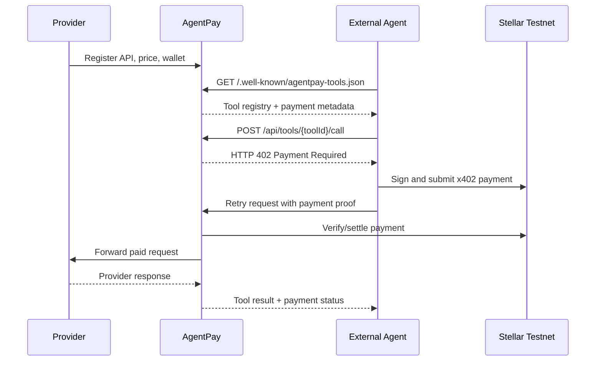
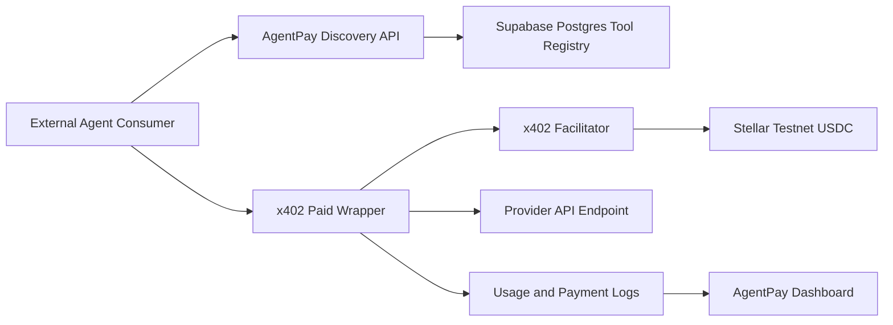

# AgentPay

AgentPay is an x402-powered API marketplace where external AI agents can discover paid tools, pay per request with Stellar testnet USDC, and receive provider responses only after payment settlement.

Live demo: [https://agent-pay-jet.vercel.app](https://agent-pay-jet.vercel.app)

## Quick Review Path

For a fast review, open the live demo and follow this path:

1. Visit the landing page to understand the product framing.
2. Open `/marketplace` to inspect paid tools exposed to agents.
3. Open `/.well-known/agentpay-tools.json` to see the machine-readable discovery document.
4. Run the external consumer demo:

```bash
npm run demo:agent -- "Explain x402 on Stellar"
```

5. Open `/logs` to verify that the paid call produced a payment and usage receipt.

## Why AgentPay Exists

AI agents are becoming better at calling APIs, but most API monetization still assumes a human checkout flow: accounts, dashboards, subscriptions, invoices, and manual billing. That flow is awkward for autonomous agents that need to discover a tool, understand the price, pay for exactly one call, and continue the task.

AgentPay explores a simpler model:

- Providers publish normal HTTP APIs as paid tools.
- Agents discover tools through a machine-readable registry.
- AgentPay returns an HTTP `402 Payment Required` response when a paid tool is called.
- The agent pays with x402 on Stellar testnet.
- AgentPay forwards the request to the provider only after payment succeeds.
- The dashboard records usage, payment proof, and provider response evidence.

The core product is not an in-app chatbot. AgentPay is infrastructure for external agents, scripts, and runtimes that need paid API access.

## What This MVP Demonstrates

- Provider registration for API tools.
- Public marketplace for human browsing.
- Machine-readable tool discovery for agents.
- x402 paid wrapper endpoints.
- Stellar testnet USDC payment settlement.
- Provider API forwarding after successful payment.
- Payment and usage logs.
- External agent consumer demo in `examples/agent-consumer`.

## Product Flow



## Main Surfaces

| Surface | Path | Purpose |
| --- | --- | --- |
| Landing page | `/` | Product explanation and interactive payment flow |
| Marketplace | `/marketplace` | Human-readable view of available paid tools |
| Provider console | `/provider` | Register APIs as paid tools |
| Payment logs | `/logs` | Inspect paid calls, wallets, proofs, and response previews |
| Health check | `/api/health` | Verify app and database connectivity |
| Discovery API | `/.well-known/agentpay-tools.json` | Agent-facing tool registry |
| Tools API | `/api/tools` | List or register tools |
| Paid wrapper | `/api/tools/{toolId}/call` | x402-protected tool invocation |

## Architecture



## Tech Stack

- Next.js App Router
- TypeScript
- Tailwind CSS
- Prisma ORM
- Supabase Postgres
- x402 packages
- Stellar testnet
- Motion and Sonner for UI interaction

## API Overview

### Discover Tools

```http
GET /.well-known/agentpay-tools.json
```

Returns a machine-readable registry of active tools, including payment metadata:

```json
{
  "name": "AgentPay",
  "protocol": "agentpay-tools",
  "tools": [
    {
      "id": "tool_id",
      "name": "Stellar Explainer",
      "description": "Explains Stellar, Soroban, x402, wallets, and testnet payment concepts.",
      "callUrl": "/api/tools/tool_id/call",
      "absoluteCallUrl": "https://agent-pay-jet.vercel.app/api/tools/tool_id/call",
      "payment": {
        "protocol": "x402",
        "scheme": "exact",
        "price": "$0.01",
        "asset": "USDC",
        "network": "stellar:testnet",
        "payTo": "G..."
      }
    }
  ]
}
```

### Register A Tool

```http
POST /api/tools
```

If `TOOL_REGISTRATION_TOKEN` is configured, include:

```http
x-agentpay-registration-token: <token>
```

Example body:

```json
{
  "providerName": "Example Provider",
  "providerWallet": "G...",
  "name": "Example Tool",
  "description": "A paid API tool exposed through AgentPay.",
  "category": "utility",
  "endpointUrl": "https://example.com/api/tool",
  "method": "POST",
  "priceAmount": "0.01",
  "priceAsset": "USDC",
  "inputExampleJson": {
    "input": "hello"
  },
  "outputExampleJson": {
    "result": "world"
  }
}
```

### Call A Paid Tool

```http
POST /api/tools/{toolId}/call
```

Without payment, the endpoint returns `402 Payment Required`. The external agent then signs a Stellar testnet payment payload through the x402 client and retries the same request with payment headers. After settlement, AgentPay forwards the request to the provider API.

## External Agent Demo

The demo consumer is intentionally outside the app UI. It behaves like an external agent runtime.

```bash
npm run demo:agent -- "Explain x402 on Stellar"
```

The script will:

1. Fetch `/.well-known/agentpay-tools.json`.
2. Select a tool using `KeywordToolSelector`.
3. Call the paid wrapper endpoint.
4. Receive HTTP `402`.
5. Create and sign an x402 Stellar payment.
6. Retry the request with payment proof.
7. Print the payment proof and provider response.

OpenAI-based tool planning is optional future work. The MVP works without `OPENAI_API_KEY`.

## Local Development

### 1. Install Dependencies

```bash
npm install
```

### 2. Create Environment Files

```bash
cp .env.example .env
cp .env.local.example .env.local
```

Use `.env` for database/runtime config and `.env.local` for local wallet secrets.

### 3. Configure `.env`

```bash
DATABASE_URL="postgresql://..."
DIRECT_URL="postgresql://..."
NEXT_PUBLIC_APP_URL="http://localhost:3000"

STELLAR_NETWORK="stellar:testnet"
STELLAR_RPC_URL="https://soroban-testnet.stellar.org"
X402_FACILITATOR_URL="https://www.x402.org/facilitator"
PROVIDER_REQUEST_TIMEOUT_MS="12000"

DEMO_PROVIDER_STELLAR_PUBLIC_KEY="G..."
TOOL_REGISTRATION_TOKEN="long-random-token"
```

### 4. Configure `.env.local`

```bash
AGENT_STELLAR_SECRET_KEY="S..."
DEMO_PROVIDER_STELLAR_PUBLIC_KEY="G..."
```

Do not commit secret keys. Do not put `AGENT_STELLAR_SECRET_KEY` in Vercel unless you intentionally build a server-side demo runner. In the current architecture, the external agent owns the payer wallet.

### 5. Push Schema And Seed

```bash
npm run db:push:direct
npm run db:seed:direct
```

The seed creates one demo provider and three paid tools:

- Paper Summarizer
- Campus FAQ RAG
- Stellar Explainer

### 6. Run The App

```bash
npm run dev
```

Then open:

```txt
http://localhost:3000
```

### 7. Verify Local Health

```bash
curl http://localhost:3000/api/health
curl http://localhost:3000/.well-known/agentpay-tools.json
```

Expected health response:

```json
{
  "ok": true,
  "service": "agentpay",
  "network": "stellar:testnet"
}
```

## Deployment Notes

AgentPay is designed to run on Vercel with Supabase Postgres.

Required Vercel environment variables:

```bash
DATABASE_URL="postgresql://..."
DIRECT_URL="postgresql://..."
NEXT_PUBLIC_APP_URL="https://agent-pay-jet.vercel.app"
STELLAR_NETWORK="stellar:testnet"
STELLAR_RPC_URL="https://soroban-testnet.stellar.org"
X402_FACILITATOR_URL="https://www.x402.org/facilitator"
PROVIDER_REQUEST_TIMEOUT_MS="12000"
DEMO_PROVIDER_STELLAR_PUBLIC_KEY="G..."
TOOL_REGISTRATION_TOKEN="long-random-token"
```

After the Vercel URL is known, seed again from your local machine so demo provider endpoints point to the deployed app instead of localhost:

```bash
NEXT_PUBLIC_APP_URL="https://agent-pay-jet.vercel.app" npm run db:seed:direct
```

See [docs/deployment.md](docs/deployment.md) for the complete deployment guide.

## Verification Checklist

```bash
npm run lint
npm run build
curl https://agent-pay-jet.vercel.app/api/health
curl https://agent-pay-jet.vercel.app/.well-known/agentpay-tools.json
npm run demo:agent -- "Explain x402 on Stellar"
```

An unpaid wrapper call should return HTTP `402`:

```bash
curl -i -X POST https://agent-pay-jet.vercel.app/api/tools/<toolId>/call \
  -H "Content-Type: application/json" \
  --data '{"question":"What is x402 on Stellar?"}'
```

After a successful paid call, open:

```txt
https://agent-pay-jet.vercel.app/logs
```

The new payment should appear with status, payer wallet, provider wallet, amount, and transaction proof.

## Project Structure

```txt
src/app/
  api/
    tools/
    logs/
    health/
    provider-seed/
  marketplace/
  provider/
  logs/
src/components/
  landing/
  marketplace/
  provider-tool-form.tsx
src/lib/
  discovery.ts
  x402-server.ts
  provider-forwarding.ts
  validation.ts
  registration.ts
examples/
  agent-consumer/
prisma/
  schema.prisma
  seed.ts
```

## Current MVP Boundaries

- Payments use Stellar testnet USDC, not mainnet funds.
- Tool selection in the demo consumer uses a keyword router.
- Provider registration can be invite-gated with `TOOL_REGISTRATION_TOKEN`.
- Provider endpoints must be HTTPS in production.
- Seeded demo tools are included for judge-friendly testing.
- The project is built as a deployable MVP, not a full production billing platform.

## Future Work

- Provider account management and authenticated dashboards.
- Mainnet-ready risk controls.
- Provider verification and moderation workflow.
- Richer usage analytics and revenue reporting.
- Optional OpenAI-powered tool selector for external demo agents.
- SDKs for agent frameworks.
- Webhook callbacks for provider payment events.

## References

- [x402 documentation](https://docs.x402.org/)
- [Stellar x402 quickstart](https://developers.stellar.org/docs/build/agentic-payments/x402/quickstart-guide)
- [Supabase Prisma guide](https://supabase.com/docs/guides/database/prisma)
- [Vercel environment variables](https://vercel.com/docs/environment-variables)
