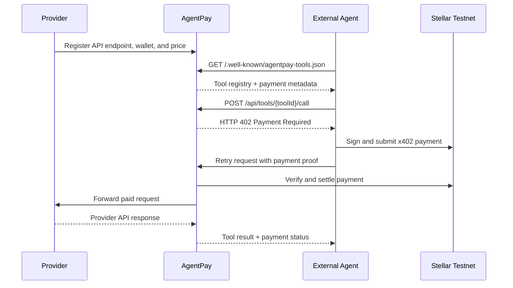
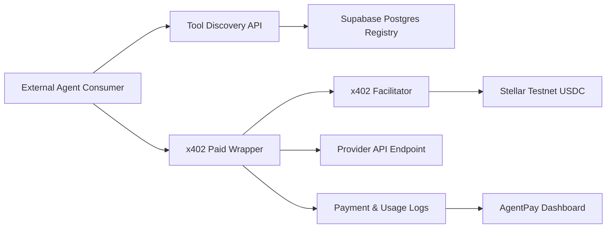

<div align="center">
  <h1>AgentPay</h1>
  <p>
    <strong>
      An x402-powered API marketplace where external AI agents discover paid tools,
      settle requests with Stellar testnet USDC, and receive provider responses only after payment.
    </strong>
  </p>
  <p>
    AgentPay turns ordinary HTTP APIs into agent-readable paid tools.
    Providers publish endpoints and prices; external agents discover the registry,
    call an x402 wrapper, pay per request, and get the API response after settlement.
  </p>
  <p>
    <a href="https://agent-pay-jet.vercel.app"><strong>Live Demo</strong></a>
    ·
    <a href="https://agent-pay-jet.vercel.app/marketplace">Marketplace</a>
    ·
    <a href="https://agent-pay-jet.vercel.app/.well-known/agentpay-tools.json">Agent Discovery JSON</a>
    ·
    <a href="https://stellar.expert/explorer/testnet/contract/CCRBSDJQ22T3RARVHUZLDYVP65DNN6HF7LVIQ7ZKMOFCK4RD7UIXTXBL">Registry Contract</a>
  </p>
  <p>
    
    
    
    
    
    
    
    
  </p>
</div>

---

## Table of Contents

- [What Is AgentPay?](#what-is-agentpay)
- [Why This Matters](#why-this-matters)
- [Live Review Path](#live-review-path)
- [Core Flow](#core-flow)
- [Architecture](#architecture)
- [Features](#features)
- [API Surface](#api-surface)
- [External Agent Demo](#external-agent-demo)
- [Freighter Provider Wallet Flow](#freighter-provider-wallet-flow)
- [On-chain Registry Proof](#on-chain-registry-proof)
- [Local Development](#local-development)
- [Environment Variables](#environment-variables)
- [Deployment](#deployment)
- [Verification Checklist](#verification-checklist)
- [Submission Evidence](#submission-evidence)
- [Project Structure](#project-structure)
- [MVP Boundaries](#mvp-boundaries)
- [Roadmap](#roadmap)

---

## What Is AgentPay?

AgentPay is a marketplace infrastructure layer for **paid agent tools**.

Instead of making AI agents go through human-style checkout flows, AgentPay exposes APIs through:

- a human-readable marketplace,
- a machine-readable discovery endpoint,
- an x402 paid wrapper endpoint,
- Stellar testnet USDC settlement,
- and payment/usage logs.

The core product is **not** an in-app chatbot. AgentPay is built for external agent runtimes, scripts, and AI systems that need to discover and pay for APIs autonomously.

---

## Why This Matters

Most API monetization still assumes a human buyer:

- create an account,
- enter a credit card,
- subscribe to a plan,
- manage billing manually,
- then call the API.

That does not fit autonomous agents well. Agents need something more direct:

1. discover available tools,
2. understand the price,
3. pay for a single request,
4. get the result,
5. keep moving.

AgentPay demonstrates this agent-native payment pattern using HTTP `402 Payment Required`, x402, and Stellar testnet USDC.

---

## Live Review Path

For judges or reviewers, the fastest path is:

1. Open the live app: [https://agent-pay-jet.vercel.app](https://agent-pay-jet.vercel.app)
2. Visit `/marketplace` to inspect available paid tools.
3. Open `/.well-known/agentpay-tools.json` to see the agent-facing discovery document.
4. Run the external consumer demo:

```bash
npm run demo:agent -- "Explain x402 on Stellar"
```

5. Open `/logs` to verify that the paid call produced a payment and usage receipt.
6. Open `/provider` to connect Freighter, verify wallet readiness, and publish a provider tool with an on-chain registry proof.

---

## Core Flow



---

## Architecture



### Stack

- **Frontend:** Next.js App Router, React, Tailwind CSS
- **Backend:** Next.js Route Handlers
- **Database:** Supabase Postgres via Prisma
- **Payment:** x402 + Stellar testnet USDC
- **Demo consumer:** TypeScript CLI in `examples/agent-consumer`
- **UI motion:** Motion + Sonner

---

## Features

### Provider Side

- Connect and disconnect a Freighter wallet.
- Detect Stellar Testnet and display XLM balance.
- Check whether the provider wallet has a USDC trustline.
- Send a tiny XLM readiness ping on testnet.
- Register an API as a paid tool.
- Set a USDC per-call price.
- Provide a Stellar testnet wallet that receives payment.
- Publish input/output examples for agent consumers.
- Sign an AgentPayRegistry contract call to anchor the tool metadata hash on-chain.
- Gate public registration with `TOOL_REGISTRATION_TOKEN`.

### Agent Side

- Fetch a machine-readable tool registry.
- Select a tool with a keyword router.
- Call an x402-protected endpoint.
- Handle HTTP `402 Payment Required`.
- Pay with Stellar testnet USDC.
- Retry the request with payment proof.
- Receive the provider response after settlement.

### Dashboard Side

- Browse active tools.
- Inspect paid call logs.
- See payer/provider wallets.
- See on-chain registration proof badges when available.
- Copy payment proof or transaction hash.
- Open transaction proof in Stellar explorer.

---

## API Surface

| Method | Path | Description |
| --- | --- | --- |
| `GET` | `/api/health` | Checks app and database connectivity |
| `GET` | `/api/tools` | Lists active tools |
| `POST` | `/api/tools` | Registers a provider API as a paid tool |
| `GET` | `/.well-known/agentpay-tools.json` | Agent-facing discovery document |
| `POST` | `/api/tools/{toolId}/call` | x402-protected paid wrapper endpoint |
| `POST` | `/api/tools/{toolId}/onchain-proof` | Stores AgentPayRegistry transaction proof after a successful contract call |
| `GET` | `/api/logs` | Returns recent payment and usage logs |

### Tool Discovery Example

```http
GET /.well-known/agentpay-tools.json
```

Example response shape:

```json
{
  "name": "AgentPay",
  "version": "0.1",
  "protocol": "agentpay-tools",
  "tools": [
    {
      "id": "tool_id",
      "name": "Stellar Explainer",
      "description": "Explains Stellar, Soroban, x402, wallets, and testnet payment concepts.",
      "callUrl": "/api/tools/tool_id/call",
      "absoluteCallUrl": "https://agent-pay-jet.vercel.app/api/tools/tool_id/call",
      "metadataHash": "4d9676...",
      "onchain": {
        "status": "registered",
        "contractId": "C...",
        "txHash": "889f7813...",
        "ledger": 123456
      },
      "payment": {
        "protocol": "x402",
        "scheme": "exact",
        "price": "$0.01",
        "asset": "USDC",
        "network": "stellar:testnet",
        "payTo": "G..."
      }
    }
  ]
}
```

### Register Tool Example

```http
POST /api/tools
x-agentpay-registration-token: <token>
Content-Type: application/json
```

```json
{
  "providerName": "Example Provider",
  "providerWallet": "G...",
  "name": "Example Tool",
  "description": "A paid API tool exposed through AgentPay.",
  "category": "utility",
  "endpointUrl": "https://example.com/api/tool",
  "method": "POST",
  "priceAmount": "0.01",
  "priceAsset": "USDC",
  "inputExampleJson": {
    "input": "hello"
  },
  "outputExampleJson": {
    "result": "world"
  }
}
```

### Paid Tool Call

```http
POST /api/tools/{toolId}/call
```

If no payment is provided, AgentPay returns HTTP `402`. The external agent signs and submits the x402 Stellar payment, then retries the same request with payment headers.

---

## External Agent Demo

The demo consumer lives outside the app:

```txt
examples/agent-consumer/index.ts
```

Run it with:

```bash
npm run demo:agent -- "Explain x402 on Stellar"
```

The consumer:

1. fetches `/.well-known/agentpay-tools.json`,
2. selects a tool using `KeywordToolSelector`,
3. calls the paid wrapper endpoint,
4. receives HTTP `402`,
5. signs an x402 Stellar payment using `AGENT_STELLAR_SECRET_KEY`,
6. retries the request,
7. prints payment proof and provider response.

OpenAI-based tool selection is optional future work. The MVP works without `OPENAI_API_KEY`.

---

## Freighter Provider Wallet Flow

The Provider Console includes the Stellar requirements without turning AgentPay into a wallet demo.

Provider flow:

1. Connect Freighter.
2. Confirm the wallet is on Stellar Testnet.
3. Display the connected public key.
4. Fetch and show the wallet XLM balance.
5. Check for a USDC trustline.
6. Send a tiny XLM readiness ping to a configured testnet recipient.
7. Use the same wallet as the provider payout wallet.
8. Sign the AgentPayRegistry contract call when publishing a tool.

The XLM transaction is intentionally framed as a readiness ping. The core product remains the paid API marketplace.

## On-chain Registry Proof

AgentPay includes a Soroban smart contract:

```txt
contracts/agentpay_registry
```

Contract functions:

- `register_tool(provider, tool_id, metadata_hash)`
- `get_tool(tool_id)`

The contract stores:

- provider address,
- canonical metadata hash,
- registered ledger.

It also requires provider authorization with `provider.require_auth()` and emits a `ToolRegistered` event.

Why this contract exists:

- Supabase stores marketplace data, endpoint URLs, discovery payloads, and logs.
- AgentPayRegistry anchors a compact proof that a provider wallet registered a specific tool metadata hash.
- Large mutable API metadata stays off-chain where it belongs.

### Contract Deployment

Build the contract:

```bash
stellar contract build --manifest-path Cargo.toml --package agentpay_registry
```

Create and fund a deployer identity on Stellar Testnet:

```bash
stellar keys generate agentpay-deployer --network testnet

stellar keys fund agentpay-deployer \
  --network testnet \
  --rpc-url https://soroban-testnet.stellar.org \
  --network-passphrase "Test SDF Network ; September 2015"
```

Deploy to Stellar Testnet:

```bash
stellar contract deploy \
  --wasm target/wasm32v1-none/release/agentpay_registry.wasm \
  --source-account agentpay-deployer \
  --network testnet \
  --rpc-url https://soroban-testnet.stellar.org \
  --network-passphrase "Test SDF Network ; September 2015" \
  --alias agentpay_registry
```

The current deployed registry contract is:

```bash
NEXT_PUBLIC_AGENTPAY_REGISTRY_CONTRACT_ID="CCRBSDJQ22T3RARVHUZLDYVP65DNN6HF7LVIQ7ZKMOFCK4RD7UIXTXBL"
```

Current contract evidence:

| Item | Value |
| --- | --- |
| Contract address | [`CCRBSDJQ22T3RARVHUZLDYVP65DNN6HF7LVIQ7ZKMOFCK4RD7UIXTXBL`](https://stellar.expert/explorer/testnet/contract/CCRBSDJQ22T3RARVHUZLDYVP65DNN6HF7LVIQ7ZKMOFCK4RD7UIXTXBL) |
| WASM upload transaction | [`ba77719b5b707941a7804cb8aa2a1d5bca597478ceddeb1edec6596835a91f2d`](https://stellar.expert/explorer/testnet/tx/ba77719b5b707941a7804cb8aa2a1d5bca597478ceddeb1edec6596835a91f2d) |
| Contract deployment transaction | [`ad32ce2bad1129a6174a41e85f50e5cb9a1194794e7bd67ecd674e12a446454c`](https://stellar.expert/explorer/testnet/tx/ad32ce2bad1129a6174a41e85f50e5cb9a1194794e7bd67ecd674e12a446454c) |
| Latest provider registration transaction | `Pending final Provider Console registration test` |

---

## Local Development

### 1. Install Dependencies

```bash
npm install
```

### 2. Create Environment Files

```bash
cp .env.example .env
cp .env.local.example .env.local
```

Use:

- `.env` for database/runtime config
- `.env.local` for local wallet secrets

### 3. Push Schema And Seed

```bash
npm run db:push:direct
npm run db:seed:direct
```

The seed creates:

- Paper Summarizer
- Campus FAQ RAG
- Stellar Explainer

### 4. Start Development Server

```bash
npm run dev
```

Open:

```txt
http://localhost:3000
```

---

## Environment Variables

### `.env`

```bash
DATABASE_URL="postgresql://..."
DIRECT_URL="postgresql://..."
NEXT_PUBLIC_APP_URL="http://localhost:3000"

STELLAR_NETWORK="stellar:testnet"
STELLAR_RPC_URL="https://soroban-testnet.stellar.org"
NEXT_PUBLIC_STELLAR_HORIZON_URL="https://horizon-testnet.stellar.org"
NEXT_PUBLIC_STELLAR_RPC_URL="https://soroban-testnet.stellar.org"
NEXT_PUBLIC_STELLAR_NETWORK_PASSPHRASE="Test SDF Network ; September 2015"
NEXT_PUBLIC_STELLAR_READINESS_RECIPIENT_PUBLIC_KEY="G..."
NEXT_PUBLIC_STELLAR_READINESS_PING_AMOUNT="0.00001"
NEXT_PUBLIC_AGENTPAY_REGISTRY_CONTRACT_ID="C..."
X402_FACILITATOR_URL="https://www.x402.org/facilitator"
PROVIDER_REQUEST_TIMEOUT_MS="12000"

DEMO_PROVIDER_STELLAR_PUBLIC_KEY="G..."
TOOL_REGISTRATION_TOKEN="long-random-token"
```

### `.env.local`

```bash
AGENT_STELLAR_SECRET_KEY="S..."
DEMO_PROVIDER_STELLAR_PUBLIC_KEY="G..."
NEXT_PUBLIC_STELLAR_READINESS_RECIPIENT_PUBLIC_KEY="G..."
```

Do not commit secret keys. The agent wallet secret belongs to the external consumer runtime, not the marketplace server. Public `NEXT_PUBLIC_` values are safe to expose, but still need to point at the correct testnet resources.

---

## Deployment

AgentPay is deployed on Vercel with Supabase Postgres.

Required Vercel variables:

```bash
DATABASE_URL="postgresql://..."
DIRECT_URL="postgresql://..."
NEXT_PUBLIC_APP_URL="https://agent-pay-jet.vercel.app"
STELLAR_NETWORK="stellar:testnet"
STELLAR_RPC_URL="https://soroban-testnet.stellar.org"
NEXT_PUBLIC_STELLAR_HORIZON_URL="https://horizon-testnet.stellar.org"
NEXT_PUBLIC_STELLAR_RPC_URL="https://soroban-testnet.stellar.org"
NEXT_PUBLIC_STELLAR_NETWORK_PASSPHRASE="Test SDF Network ; September 2015"
NEXT_PUBLIC_STELLAR_READINESS_RECIPIENT_PUBLIC_KEY="G..."
NEXT_PUBLIC_STELLAR_READINESS_PING_AMOUNT="0.00001"
NEXT_PUBLIC_AGENTPAY_REGISTRY_CONTRACT_ID="C..."
X402_FACILITATOR_URL="https://www.x402.org/facilitator"
PROVIDER_REQUEST_TIMEOUT_MS="12000"
DEMO_PROVIDER_STELLAR_PUBLIC_KEY="G..."
TOOL_REGISTRATION_TOKEN="long-random-token"
```

Do **not** add `AGENT_STELLAR_SECRET_KEY` to Vercel unless a server-side demo runner is intentionally added later.

After deployment, seed again from your local machine so demo provider endpoints point to the deployed URL:

```bash
NEXT_PUBLIC_APP_URL="https://agent-pay-jet.vercel.app" npm run db:seed:direct
```

Full guide: [docs/deployment.md](docs/deployment.md)

---

## Verification Checklist

```bash
npm run lint
npm test
npm run build
cargo test --manifest-path contracts/agentpay_registry/Cargo.toml
stellar contract build --manifest-path Cargo.toml --package agentpay_registry
```

Check the deployed app:

```bash
curl https://agent-pay-jet.vercel.app/api/health
curl https://agent-pay-jet.vercel.app/.well-known/agentpay-tools.json
```

Run the paid flow:

```bash
npm run demo:agent -- "Explain x402 on Stellar"
```

An unpaid wrapper call should return HTTP `402`:

```bash
curl -i -X POST https://agent-pay-jet.vercel.app/api/tools/<toolId>/call \
  -H "Content-Type: application/json" \
  --data '{"question":"What is x402 on Stellar?"}'
```

After a successful paid call, open:

```txt
https://agent-pay-jet.vercel.app/logs
```

Manual Stellar checks:

- Connect Freighter on Testnet in `/provider`.
- Confirm the XLM balance appears.
- Send the readiness ping and copy the transaction hash.
- Publish a provider tool.
- Sign the AgentPayRegistry transaction.
- Confirm the marketplace shows `on-chain registered`.

---

## Submission Evidence

Required evidence for the Stellar Level 3+4 submission:

| Evidence | Link / Screenshot |
| --- | --- |
| Live demo | [https://agent-pay-jet.vercel.app](https://agent-pay-jet.vercel.app) |
| CI pipeline | [GitHub Actions](https://github.com/wildanniam/AgentPay/actions/workflows/ci.yml) |
| AgentPayRegistry contract | [`CCRBSDJQ22T3RARVHUZLDYVP65DNN6HF7LVIQ7ZKMOFCK4RD7UIXTXBL`](https://stellar.expert/explorer/testnet/contract/CCRBSDJQ22T3RARVHUZLDYVP65DNN6HF7LVIQ7ZKMOFCK4RD7UIXTXBL) |
| Contract deploy transaction | [`ad32ce2bad1129a6174a41e85f50e5cb9a1194794e7bd67ecd674e12a446454c`](https://stellar.expert/explorer/testnet/tx/ad32ce2bad1129a6174a41e85f50e5cb9a1194794e7bd67ecd674e12a446454c) |
| x402 demo payment transaction | [`977fea7f0af5e4fe1da56659b9b0bc96899dc2dd27bbb4f1eb7116fd119b115a`](https://stellar.expert/explorer/testnet/tx/977fea7f0af5e4fe1da56659b9b0bc96899dc2dd27bbb4f1eb7116fd119b115a) |
| 3+ passing tests screenshot | `TODO: add screenshot after final test run` |
| Mobile responsive screenshot | `TODO: add mobile screenshot` |
| 1-minute demo video | `TODO: add demo video link` |
| Frontend provider registration transaction | `TODO: add tx hash after publishing one tool from Provider Console` |

---

## Project Structure

```txt
src/app/
  api/
    health/
    logs/
    provider-seed/
    tools/
  logs/
  marketplace/
  provider/

src/components/
  landing/
  marketplace/
  provider-wallet-readiness.tsx
  provider-tool-form.tsx

src/lib/
  discovery.ts
  env.ts
  provider-forwarding.ts
  registration.ts
  stellar-browser.ts
  tool-metadata.ts
  tools.ts
  validation.ts
  x402-server.ts

contracts/
  agentpay_registry/

examples/
  agent-consumer/

prisma/
  schema.prisma
  seed.ts

tests/
  discovery.test.ts
  tool-metadata.test.ts
  validation.test.ts
```

---

## MVP Boundaries

- Payments use Stellar testnet USDC, not mainnet funds.
- The marketplace uses Supabase Postgres as the off-chain registry.
- AgentPayRegistry stores compact registration proof, not full marketplace data.
- Demo tool selection uses a keyword router.
- Provider registration can be protected with `TOOL_REGISTRATION_TOKEN`.
- Provider endpoints must use HTTPS in production.
- Seeded tools are included for judge-friendly testing.

---

## Roadmap

- Provider accounts and authenticated dashboards
- Mainnet-ready payment controls
- Provider verification and moderation
- Revenue analytics
- Optional OpenAI-powered tool selector
- Agent SDKs
- Webhooks for provider payment events
- Escrow, refunds, revenue splitting, or provider staking contracts

---

## References

- [x402 documentation](https://docs.x402.org/)
- [Stellar x402 quickstart](https://developers.stellar.org/docs/build/agentic-payments/x402/quickstart-guide)
- [Freighter web app API](https://docs.freighter.app/docs/guide/usingfreighterwebapp/)
- [Prompt Freighter to sign transactions](https://developers.stellar.org/docs/build/guides/freighter/prompt-to-sign-tx)
- [Deploy Stellar smart contracts to testnet](https://developers.stellar.org/docs/build/smart-contracts/getting-started/deploy-to-testnet)
- [Supabase Prisma guide](https://supabase.com/docs/guides/database/prisma)
- [Vercel environment variables](https://vercel.com/docs/environment-variables)
